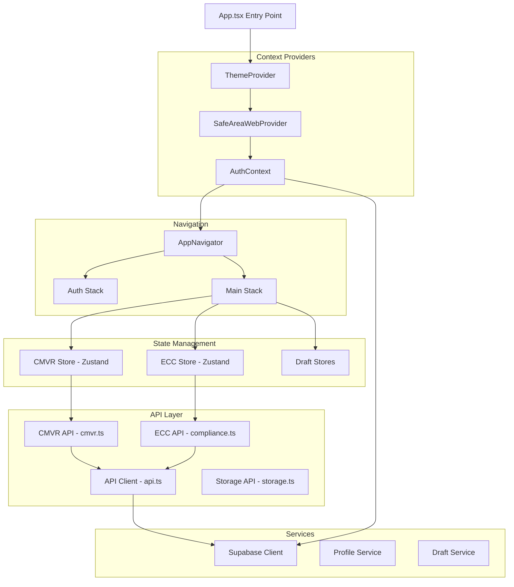
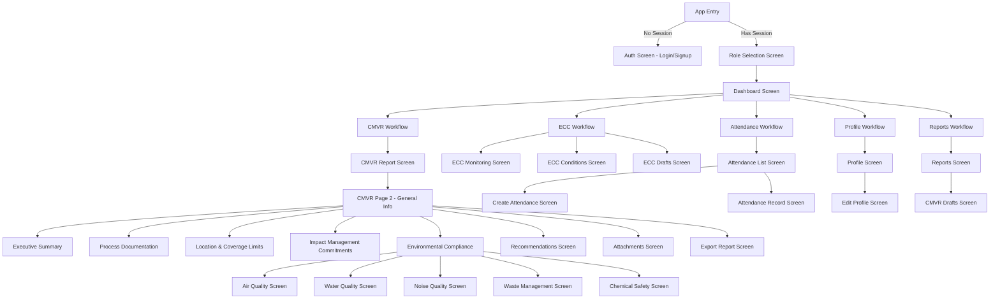
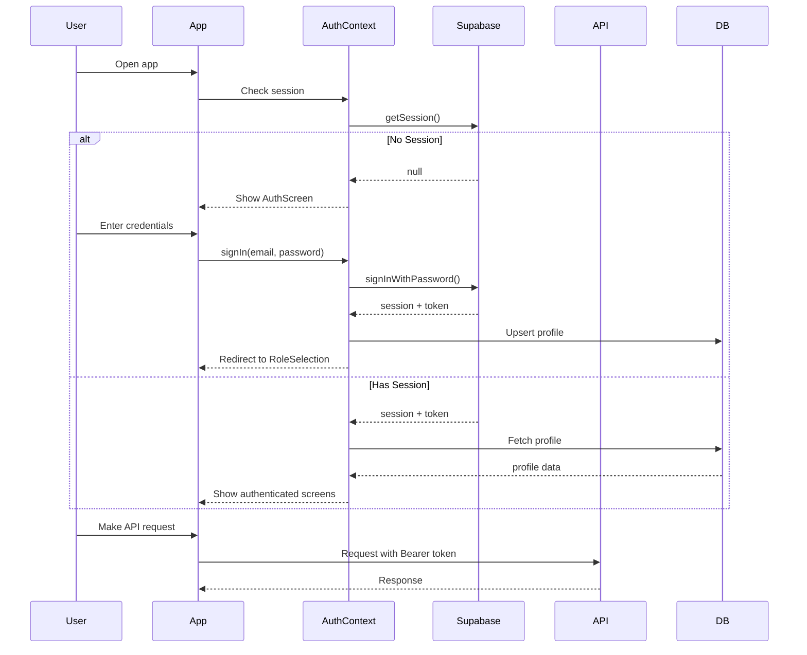
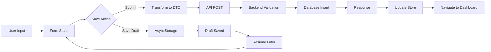
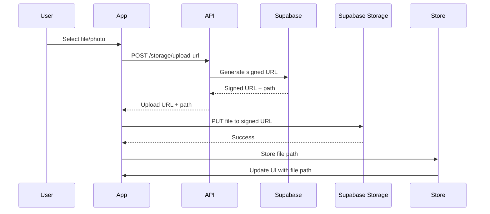

# MineComply Mobile App - Architecture Documentation

> Last Updated: December 2025

## Table of Contents

- [Overview](#overview)
- [Tech Stack](#tech-stack)
- [App Architecture](#app-architecture)
- [Project Structure](#project-structure)
- [Navigation Flow](#navigation-flow)
- [State Management](#state-management)
- [Authentication Flow](#authentication-flow)
- [Data Flow](#data-flow)
- [Local Storage Strategy](#local-storage-strategy)
- [API Integration](#api-integration)
- [UI/UX Architecture](#uiux-architecture)

---

## Overview

The MineComply Mobile App is a React Native application built with Expo that enables mining proponents and monitoring teams to create, manage, and submit compliance reports. The app features offline draft capabilities, document generation, and integration with the MineComply API.

**Key Capabilities:**
- **CMVR Report Creation**: Multi-section compliance monitoring forms
- **ECC Monitoring**: Track environmental compliance certificate conditions
- **Attendance Management**: Record meeting attendance with digital signatures
- **Draft System**: Save work locally and resume later
- **Document Export**: Generate PDF and DOCX documents
- **File Management**: Upload and manage attachments

---

## Tech Stack

| Component | Technology | Purpose |
|-----------|-----------|---------|
| **Framework** | React Native 0.81.5 | Cross-platform mobile development |
| **Platform** | Expo 54.x | Development tooling and native modules |
| **Language** | TypeScript 5.9.x | Type-safe development |
| **Navigation** | React Navigation 7.x | Screen navigation and routing |
| **State Management** | Zustand 5.x | Global state management |
| **Styling** | NativeWind (TailwindCSS) | Utility-first styling |
| **Forms** | React Native components | Form handling |
| **Local Storage** | AsyncStorage | Persistent local data |
| **Authentication** | Supabase Auth | User authentication |
| **API Client** | Fetch API | HTTP requests |
| **File Handling** | Expo FileSystem, Expo DocumentPicker | File operations |
| **Camera** | Expo Camera | Photo capture |
| **Signatures** | react-native-signature-canvas | Digital signatures |

---

## App Architecture



### Architectural Principles

1. **Unidirectional Data Flow**: State flows down, actions flow up
2. **Separation of Concerns**: Clear boundaries between UI, state, and API
3. **Offline-First**: Local drafts enable work without connectivity
4. **Type Safety**: TypeScript throughout for compile-time safety
5. **Reusable Components**: Shared UI components across screens
6. **Context for Cross-Cutting Concerns**: Auth, theme, safe area handled via context

---

## Project Structure

```
minecomplyapp/
├── App.tsx                      # App entry point
├── index.ts                     # Expo entry point
│
├── assets/                      # Static assets (images, fonts)
│   ├── images/
│   ├── icon.png
│   └── splash-icon.png
│
├── components/                  # Reusable UI components
│   ├── Button.tsx
│   ├── CheckBox.tsx
│   ├── CMSHeader.tsx
│   ├── CustomHeader.tsx
│   ├── RadioButton.tsx
│   ├── ScreenWrapper.tsx
│   └── Themed.tsx
│
├── contexts/                    # React Context providers
│   ├── AuthContext.tsx         # Authentication state and methods
│   ├── FileNameContext.tsx     # File name management
│   └── SafeAreaWebContext.tsx  # Safe area insets for web
│
├── hooks/                       # Custom React hooks
│   ├── useResponsive.ts        # Responsive design utilities
│   └── useSafeAreaWeb.ts       # Safe area hook for web
│
├── lib/                         # API and utility functions
│   ├── api.ts                  # Base API client
│   ├── cmvr.ts                 # CMVR API functions
│   ├── compliance.ts           # ECC API functions
│   ├── drafts.ts               # Draft persistence
│   ├── draftSchema.ts          # Draft type definitions
│   ├── profile.ts              # Profile API functions
│   ├── storage.ts              # File storage functions
│   └── supabase.ts             # Supabase client setup
│
├── navigation/                  # Navigation configuration
│   └── AppNavigator.tsx        # Main navigation component
│
├── screens/                     # All app screens
│   ├── auth/                   # Authentication screens
│   ├── dashboard/              # Dashboard and home screens
│   ├── CMVRPAGE/               # CMVR report screens (180+ files)
│   ├── ecc/                    # ECC monitoring screens
│   ├── attendance/             # Attendance screens
│   ├── profile/                # User profile screens
│   ├── reports/                # Reports list screen
│   ├── role-selection/         # Role selection screen
│   └── SubmissionsScreen.tsx  # Submissions overview
│
├── store/                       # Zustand state stores
│   ├── api.js                  # API base URL configuration
│   ├── cmvrStore.js            # CMVR report state
│   ├── cmvrTestData.js         # Test data generator
│   ├── cmvrTransformers.js     # Data transformers
│   ├── eccDraftStore.js        # ECC draft state
│   └── eccStore.js             # ECC report state
│
├── theme/                       # Theme configuration
│   ├── index.ts
│   ├── theme.ts
│   └── ThemeProvider.tsx
│
├── types/                       # TypeScript type definitions
│   └── index.ts
│
├── utils/                       # Utility functions
│   └── responsive.ts           # Responsive design utilities
│
├── app.config.js               # Expo configuration
├── package.json                # Dependencies
└── tsconfig.json               # TypeScript config
```

---

## Navigation Flow

### Navigation Hierarchy



### Navigation Stack Configuration

**Unauthenticated Stack:**
- AuthScreen (Login/Signup)

**Authenticated Stack:**
- RoleSelection
- Dashboard (home)
- All feature screens
- Profile screens

### Screen Navigation Patterns

1. **Push Navigation**: Most screens use standard push navigation
2. **Modal Navigation**: Used for overlays (none currently)
3. **Tab Navigation**: Not currently used (single stack)
4. **Deep Linking**: Prepared for future implementation

---

## State Management

### Zustand Stores

#### 1. CMVR Store (`store/cmvrStore.js`)

**Purpose**: Manage CMVR report state, drafts, and API operations

**Key State:**
```javascript
{
  currentReport: null,           // Current report being edited
  fileName: "Untitled",          // Report file name
  submissionId: null,            // Submitted report ID
  projectId: null,               // Associated project
  projectName: "",               // Project name
  createdById: null,             // Creator user ID
  submittedReports: [],          // List of submitted reports
  isLoading: false,              // API loading state
  isSaving: false,               // Save operation state
  error: null,                   // Error messages
  isDirty: false,                // Unsaved changes flag
  editedSections: [],            // Modified sections tracking
  isDraftLoaded: false,          // Draft loaded flag
  lastSavedAt: null             // Last save timestamp
}
```

**Key Actions:**
- `initializeNewReport()` - Create empty report
- `updateSection()` - Update single section
- `updateMultipleSections()` - Update multiple sections
- `loadReport()` - Load existing report
- `saveDraft()` - Save to AsyncStorage
- `loadDraft()` - Load from AsyncStorage
- `submitReport()` - Submit to API
- `updateSubmittedReport()` - Update existing submission
- `fetchUserReports()` - Get user's reports
- `deleteSubmittedReport()` - Delete report

#### 2. ECC Store (`store/eccStore.js`)

**Purpose**: Manage ECC report state and operations

**Key Features:**
- Report creation and management
- Condition tracking
- Draft persistence
- API integration

#### 3. ECC Draft Store (`store/eccDraftStore.js`)

**Purpose**: Specialized draft management for ECC reports

**Key Features:**
- Multi-draft support
- Draft metadata tracking
- Save/load/delete operations

### State Flow Pattern

```
User Action → Screen Component → Store Action → API Call → Store Update → UI Re-render
```

Example:
```javascript
// User saves CMVR section
onSave() {
  // 1. Update store
  useCmvrStore.getState().updateSection('generalInfo', formData);
  
  // 2. Save draft locally
  await useCmvrStore.getState().saveDraft();
  
  // 3. Navigate or show success
  navigation.goBack();
}
```

---

## Authentication Flow



### AuthContext Provider

**Location**: `contexts/AuthContext.tsx`

**Provides:**
- `session` - Supabase session object
- `user` - Authenticated user
- `profile` - Extended user profile from database
- `loading` - Auth state loading flag
- `signIn()` - Sign in method
- `signUp()` - Sign up method
- `signOut()` - Sign out method
- `refreshProfile()` - Reload profile from DB
- `updateLocalProfile()` - Update profile optimistically

**Profile Sync Strategy:**
1. User signs in/up via Supabase Auth
2. AuthContext syncs metadata to `profiles` table
3. Profile data persisted for offline access
4. Automatic refresh on auth state change

---

## Data Flow

### CMVR Report Creation Flow



### Data Transformation Pipeline

**UI Form → Store → DTO → API → Database**

1. **UI Form Data**: Structured for form components
2. **Store Data**: Normalized for easy updates
3. **DTO (Data Transfer Object)**: Backend-compatible format
4. **Database**: Stored as JSON in PostgreSQL

**Example Transformation:**

```javascript
// UI Form (sections as separate objects)
{
  generalInfo: { companyName: "...", location: "..." },
  executiveSummary: { ... },
  // ... other sections
}

// Transform to Backend DTO
{
  cmvrData: {
    generalInfo: { ... },
    executiveSummaryOfCompliance: { ... },
    // ... transformed sections
  },
  attachments: [ ... ]
}

// Database Storage
{
  id: "uuid",
  fileName: "Q3_2025_CMVR",
  cmvrData: { /* nested JSON */ },
  createdById: "user-uuid"
}
```

### File Upload Flow



---

## Local Storage Strategy

### AsyncStorage Usage

**Storage Keys:**
- `@cmvr_draft` - Single active CMVR draft
- `cmvr_draft_<fileName>` - Named CMVR drafts
- `ecc_draft_<id>` - ECC drafts
- User session data (managed by Supabase)

### Draft Management

**Multi-Draft System:**

```typescript
// Save draft
await saveDraftToStorage(fileName, draftData);

// List all drafts
const drafts = await getAllDraftMetadata();

// Load specific draft
const draft = await getDraft(draftKey);

// Delete draft
await deleteDraft(draftKey);
```

**Draft Metadata Structure:**
```typescript
{
  key: "cmvr_draft_Q3_2025",
  fileName: "Q3_2025_CMVR",
  projectName: "Mining Site A",
  lastSaved: "2025-12-03T10:00:00Z",
  createdAt: "2025-12-01T09:00:00Z"
}
```

### Data Persistence Strategy

1. **Immediate Saves**: Draft saved on section completion
2. **Auto-save**: Periodic auto-save (not yet implemented)
3. **Manual Save**: User-triggered save button
4. **Clear on Submit**: Draft deleted after successful submission

---

## API Integration

### API Client Architecture

**Base Client** (`lib/api.ts`):
```typescript
// Auto-resolves API base URL
const apiBaseUrl = resolveApiBaseUrl();

// Authenticated requests
async function apiGet<T>(path: string): Promise<T>
async function apiPost<T>(path: string, body: unknown): Promise<T>
async function apiPatch<T>(path: string, body: unknown): Promise<T>
async function apiDelete<T>(path: string): Promise<T | void>
```

**Module-Specific Clients:**
- `lib/cmvr.ts` - CMVR operations
- `lib/compliance.ts` - ECC operations
- `lib/storage.ts` - File operations
- `lib/profile.ts` - Profile operations

### API Base URL Resolution

**Priority Order:**
1. `EXPO_PUBLIC_API_BASE_URL` (deployed API)
2. `API_BASE_URL` (local override)
3. Auto-detected dev server host + `:3000`
4. Fallback: `http://localhost:3000`

**Configuration:**
```javascript
// app.config.js
extra: {
  USE_RENDER_API: process.env.USE_RENDER_API || false,
  API_BASE_URL: process.env.API_BASE_URL,
  EXPO_PUBLIC_API_BASE_URL: process.env.EXPO_PUBLIC_API_BASE_URL,
}
```

### Authentication Injection

All API requests automatically include Supabase JWT:

```typescript
const token = await getAccessToken();
fetch(url, {
  headers: {
    'Authorization': `Bearer ${token}`,
    'Content-Type': 'application/json',
  },
});
```

---

## UI/UX Architecture

### Styling Strategy

**NativeWind (TailwindCSS for React Native):**

```tsx
<View className="flex-1 bg-white px-4 py-6">
  <Text className="text-2xl font-bold text-gray-800">
    Title
  </Text>
</View>
```

**Theme System:**
- Theme context provides theme object
- ThemeProvider wraps app
- Custom theme utilities in `theme/`

### Responsive Design

**Utilities** (`utils/responsive.ts`):
- `scale(size)` - Scale based on screen width
- `verticalScale(size)` - Scale based on screen height
- `moderateScale(size, factor)` - Moderate scaling

**Usage:**
```typescript
import { scale, verticalScale } from '../utils/responsive';

const styles = StyleSheet.create({
  container: {
    padding: scale(16),
    marginTop: verticalScale(20),
  },
});
```

### Screen Wrapper Pattern

**ScreenWrapper Component:**
- Consistent padding and safe area
- Scroll view or regular view
- Keyboard avoiding behavior
- Status bar configuration

**Usage:**
```tsx
<ScreenWrapper>
  {/* Screen content */}
</ScreenWrapper>
```

### Component Patterns

1. **Reusable Components**: Button, CheckBox, RadioButton
2. **Custom Headers**: CMSHeader, CustomHeader
3. **Form Components**: TextInput wrappers, pickers, date pickers
4. **List Components**: FlatList wrappers with pull-to-refresh

---

## Best Practices

1. **State Management**: Use Zustand for global state, local state for UI only
2. **Navigation**: Pass minimal data via params, load from store/API
3. **Error Handling**: Try-catch with user-friendly error messages
4. **Loading States**: Show loading indicators for async operations
5. **Offline Support**: Check connectivity, show appropriate messaging
6. **Type Safety**: Use TypeScript interfaces for all data structures
7. **Code Organization**: Feature-based folder structure
8. **Performance**: Memoize expensive computations, optimize lists

---

## Future Improvements

1. **State Persistence**: Persist more state to AsyncStorage
2. **Offline Queue**: Queue API calls when offline
3. **Real-time Updates**: WebSocket integration for live updates
4. **Push Notifications**: Notify users of important events
5. **Biometric Auth**: Add fingerprint/Face ID support
6. **Dark Mode**: Implement full dark mode support
7. **Internationalization**: Multi-language support
8. **Performance Monitoring**: Add analytics and crash reporting

